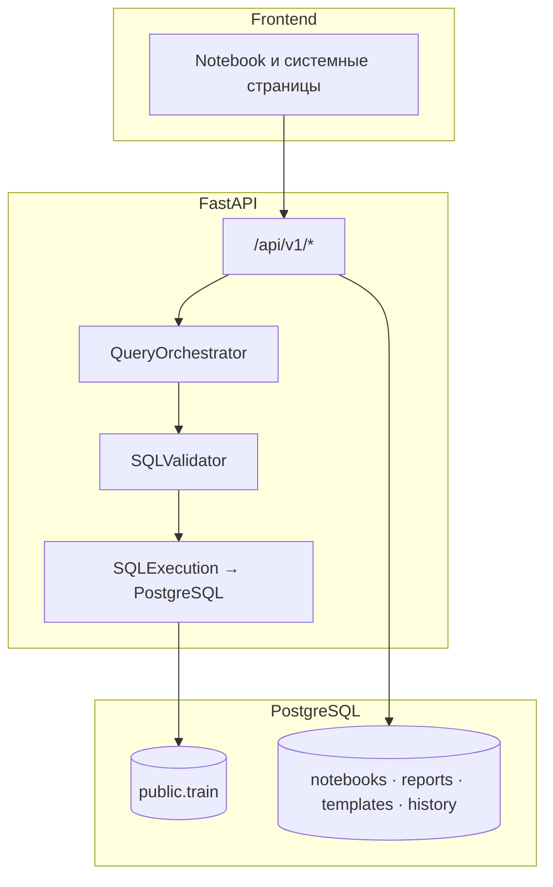

# Drivee Analytics AI

**Elevator pitch:** Drivee Analytics AI — это AI-платформа self-service аналитики, которая превращает вопрос на естественном языке в проверяемый SQL, исполняет его в PostgreSQL и возвращает **таблицу, рекомендованную визуализацию, текстовый инсайт, explainability trace и числовой confidence** — с возможностью сохранить результат как отчёт и продолжить диалог (follow-up, уточнения).

<p align="center">
  
</p>

| | |
|--|--|
| **Тема** | Self-service аналитика для команд продукта, операций и маркетинга без обязательного SQL. |
| **Для кого** | Non-tech пользователи, которым нужны ответы из данных **быстрее**, чем через очередь к аналитику, **прозрачнее**, чем «чёрный ящик» чата. |
| **Проблема** | Длинный цикл «вопрос → SQL → сверка метрик → график → объяснение», разъезжающиеся определения показателей, риск галлюцинаций у «голого» LLM. |
| **Бизнес-ценность** | Сокращение time-to-insight, единый семантический слой и guardrails снижают стоимость ошибок; notebook-артефакты и отчёты пригодны для аудита и повторного использования. |

---

## 1. Тема проекта

**Drivee Analytics AI** (продуктовое имя; репозиторий и UI также опираются на концепцию **Analytics Notebook**) — это управляемая среда аналитики, где пользователь формулирует бизнес-вопрос текстом, а платформа **оркестрирует полный контур**: интерпретация намерения → сопоставление с каноническими метриками и измерениями → генерация `SELECT` → валидация и политики безопасности → выполнение в БД → визуализация и объяснение.

**Что пользователь может сделать в MVP:**

- Задать вопрос на русском (и др.) в ячейке ноутбука и получить **таблицу результата**, **график** (рекомендация типа по форме данных и intent), **краткий инсайт**, **trace** (как система поняла запрос, какой SQL сгенерирован, статус валидации, confidence).
- Пройти **уточнение (clarification)** при неоднозначности вместо «угадывания» SQL.
- Продолжить **follow-up** в диалоге с наследованием фильтров и окна времени.
- Сохранить снимок анализа в **отчёты** (`/reports`), использовать **шаблоны** (`/templates`), смотреть **историю** (`/history`), **словарь** (`/dictionary`), загрузку CSV (`/data-upload`), **Quality Center** (`/quality`).
- Работать в **ролевых дашбордах** (admin / manager / marketer / executive) с разными профилями доступа к полям и SQL.

**Почему это «SQL IDE для non-tech», а не очередной чат:**

- Пользователь **не пишет SQL** и **не обязан знать схему** — система опирается на семантический слой (`SemanticService`, `semantic_dictionary.json`, термины в БД после seed).
- Результат оформлен как **воспроизводимый шаг ноутбука** (prompt → SQL → результат → trace), а не как поток сообщений без структуры.

**Чем отличается от классического SQL-редактора и от «просто ChatGPT»:**

| | Обычный SQL IDE | ChatGPT / generic LLM | Drivee Analytics AI |
|--|-----------------|----------------------|---------------------|
| Доступ non-tech | Нужен SQL и схема | Нет гарантий к вашей БД | NL → проверенный контур к **`public.train`** (и политикам роли) |
| Безопасность | Зависит от дисциплины | Нет встроенного guardrail к прод-данным | Whitelist таблиц/колонок, лимиты, таймауты, блокировка опасных паттернов |
| Объяснимость | Только комментарии аналитика | Текст без привязки к исполнению | **Trace**: intent, сущности, SQL, validation, confidence |
| Метрики | Расходятся между людьми | Галлюцинации имён колонок | Семантический слой и шаблоны после **seed** |

### Пример сквозного сценария (как на защите)

**Пользователь пишет:**  
«Покажи выручку по городам за прошлую неделю»

**Система:**

1. **Понимает бизнес-смысл** — intent сравнения/агрегации по географии и окну времени («прошлая неделя»).
2. **Сопоставляет термины** со словарём: «выручка» → каноническая метрика вроде **`sum_order_price`** (см. `semantic_dictionary.json` / bootstrap терминов), «города» → измерение **`city_id`**.
3. **Генерирует SQL** — `SELECT` по **`public.train`** с фильтром по времени (`order_timestamp`) и `GROUP BY city_id`.
4. **Проверяет безопасность** — валидатор (`SQLValidatorService`): разрешённые таблицы (**`train`**, staging по конфигу), политика роли, лимиты, запрет опасных конструкций.
5. **Выполняет запрос** в PostgreSQL (или controlled mock/fallback при деградации — см. `docs/demo-defense.md`).
6. **Показывает** интерактивную **таблицу**, **график** (рекомендация из `chart_recommendation` в trace), **инсайт** и **explainability trace** с **confidence**.

Техническая детализация этапов: [`docs/architecture.md`](docs/architecture.md), оркестратор: `QueryOrchestrator`.

---

## 2. Demo-доступ

Учётные записи создаются **идемпотентно** при **`make seed`** (или `docker compose run --rm backend python scripts/seed_demo_data.py`). На форме входа используется поле **email**.

**Рекомендуемый быстрый вход для демо:**

```text
Email: manager@drivee.local
Password: demo123
```

**Все демо-пользователи (тот же пароль `demo123`):**

| Email | Роль |
|-------|------|
| `admin@drivee.local` | admin |
| `manager@drivee.local` | manager |
| `marketer@drivee.local` | marketer |
| `executive@drivee.local` | executive |

Нюансы старых БД и обновления хеша пароля: [`docs/demo-users-credentials.md`](docs/demo-users-credentials.md).

---

## 3. Быстрый старт

1. Скопировать окружение: `cp .env.example .env`, `cp backend/.env.example backend/.env` (см. [`DOCKER.md`](DOCKER.md)).
2. `docker compose up --build` — поднимаются frontend, backend, PostgreSQL.
3. При необходимости: `make migrate`, затем **`make seed`**.
4. Открыть UI: **http://localhost:3001** (порт задаётся `FRONTEND_PORT` в `.env`; в контейнере приложение слушает 3000). API: **http://localhost:8000**.

Быстрая проверка стенда перед показом: `make demo-live` (см. [`docs/DEMO_LIVE_RUNBOOK.md`](docs/DEMO_LIVE_RUNBOOK.md)).

Локальный запуск без Docker — см. раздел **«Локальная разработка»** ниже.

---

## 4. Ключевые возможности MVP

| Область | Возможности |
|---------|-------------|
| **Notebook** | NL → intent → семантика → SQL → валидация → PostgreSQL → таблица, график, инсайт; опционально baseline **forecast**; trace и **confidence**. |
| **Данные** | Канонический источник **`public.train`** (VIEW над факт-таблицей заказов); CSV upload → staging; расширенные таблицы Drivee после импорта (см. [`docs/datasets/drivee-analytics-base-ru.md`](docs/datasets/drivee-analytics-base-ru.md)). |
| **Объём demo** | После seed — тысячи строк `DEMO-*`, несколько городов и каналов, окна по датам; подробнее: [`docs/demo-analytics-dataset.md`](docs/demo-analytics-dataset.md). |
| **Роли** | Разные дашборды и ограничения SQL по роли. |
| **Артефакты** | Ноутбуки и ячейки в БД; **saved reports**; **query templates**; **nl_queries_history**. |
| **Качество** | **Drivee Quality Center** (`/quality`), golden suite NL→SQL, см. [`docs/evaluation_guide.md`](docs/evaluation_guide.md). |

---

## 5. Сценарии для жюри и навигация

| Сценарий | Где в UI |
|----------|-----------|
| Операционная аналитика | `/scenarios` → `/notebooks/ops-health` |
| Clarification | `/notebooks/clarification-demo` или двусмысленный промпт |
| Follow-up | `/notebooks/follow-up-demo` |
| Отчёты, PDF | ячейка → `/reports` |
| Шаблоны | `/templates` |
| История | `/history` |
| Режим 5 сценариев | `/scenarios` → блок «Режим показа жюри» |
| Quality Center | `/quality` |

Пошагово: [`docs/jury-demo-runbook.md`](docs/jury-demo-runbook.md) · [`docs/demo-script.md`](docs/demo-script.md) · честные режимы live/mock: [`docs/demo-defense.md`](docs/demo-defense.md).

---

## 6. Архитектура (кратко)



Полная схема NL→SQL: [`docs/architecture.md`](docs/architecture.md).

**Основные маршруты frontend:** `/login`, `/register` → `/notebooks`, `/scenarios`, `/notebooks/[id]`, `/dashboard/admin|manager|marketer|executive`, `/reports`, `/history`, `/templates`, `/dictionary`, `/corrections`, `/data-upload`, `/settings`, `/forecast-lab`, `/quality`.

---

## 7. NL → SQL pipeline (сжато)

1. Препроцессинг и **диалог** (follow-up, rewrite).  
2. **Intent** и извлечение сущностей (время, `city_id`, метрики).  
3. **Semantic resolution** — канонические метрики и фрагменты SQL.  
4. **Clarification** при неоднозначности.  
5. **Генерация SQL** (`SQLGenerationService`).  
6. **Corrections** (обучение на исправлениях админа).  
7. **Валидация** — whitelist, роль, лимиты (`SQLValidatorService`).  
8. **Исполнение** в PostgreSQL или mock/fallback.  
9. **Рекомендация графика**, инсайт, **trace** с **confidence**.

---

## 8. Guardrails и семантика

- Разрешённые пользовательские таблицы: **`train`**, staging `user_staging` по паттерну из конфигурации; детали: `app/core/config.py`, `sql_validation_constants.py`.
- Роли ограничивают доступ к чувствительным колонкам и наборам метрик (в т.ч. executive).
- Семантика: `backend/app/data/semantic_dictionary.json` + `SemanticService` + термины в БД после seed.

---

## 9. Локальная разработка (без Docker)

**Backend:**

```bash
cd backend
python3.11 -m venv .venv
source .venv/bin/activate
pip install -r requirements.txt
# DATABASE_URL в backend/.env
uvicorn app.main:app --reload --port 8000
```

Применить `backend/sql/bootstrap_drivee.sql`, `alembic upgrade head`, затем `python scripts/seed_demo_data.py`.

**Frontend:**

```bash
cd frontend
npm install
npm run dev
```

---

## 10. Тесты и качество

```bash
make test-smoke
make test-nl
make test-guardrails
make test-cov-core
make test-e2e-quick   # быстрый pre-demo smoke
make test-e2e         # полный browser gate
make quality-eval
```

---

## 11. Seed и импорт данных

- **`make seed`** — пользователи, контекст, семантика, шаблоны, ноутбук, массовые заказы `DEMO-*`.
- Только бизнес-ряды без полного сида: `python -m app.demo_data.seed_analytics_orders` (из контейнера/venv backend).
- Импорт расширенного набора Drivee (после `alembic upgrade head` доступны `incity_orders`, `passenger_daily_metrics`, `driver_daily_metrics`) — см. схему в [`docs/datasets/drivee-analytics-base-ru.md`](docs/datasets/drivee-analytics-base-ru.md). Пример:

```bash
docker compose exec backend python scripts/import_drivee_dataset.py \
  --incity /data/incity.csv --replace-incity \
  --pass-detail /data/pass_detail.csv --replace-pass \
  --driver-detail /data/driver_detail.csv --replace-driver
```

---

## 12. Скриншоты

Добавьте изображения в `docs/screenshots/` и обновите ссылки ниже (сейчас — плейсхолдеры для подготовки презентации).

| Файл | Что показать |
|------|----------------|
| `./docs/screenshots/logo.png` | **TODO:** логотип продукта |
| `./docs/screenshots/01-login.png` | **TODO:** форма входа (email + пароль) |
| `./docs/screenshots/02-notebook-prompt.png` | **TODO:** ячейка с NL-запросом |
| `./docs/screenshots/03-table-chart-trace.png` | **TODO:** таблица, график, панель trace / confidence |
| `./docs/screenshots/04-clarification.png` | **TODO:** сценарий уточнения |
| `./docs/screenshots/05-reports.png` | **TODO:** сохранённый отчёт |
| `./docs/screenshots/06-quality-center.png` | **TODO:** Quality Center |

---

## 13. Ограничения MVP и roadmap

Инженерно честные границы показа (live / fallback / mock): [`docs/demo-defense.md`](docs/demo-defense.md).  
План развития: [`docs/improvement-roadmap.md`](docs/improvement-roadmap.md).  
Архитектура и контракты: [`docs/domain-contracts-and-runtime-modes.md`](docs/domain-contracts-and-runtime-modes.md).

---

## 14. Tech stack

- **Frontend:** Next.js 14, TypeScript, Tailwind, React Query, Recharts  
- **Backend:** FastAPI, SQLAlchemy 2, Pydantic  
- **БД:** PostgreSQL  

---

## 15. Документация (карта)

| Документ | Назначение |
|----------|------------|
| [`docs/architecture.md`](docs/architecture.md) | Архитектура и модули |
| [`docs/jury-demo-runbook.md`](docs/jury-demo-runbook.md) | 5 сценариев для комиссии |
| [`docs/demo-defense.md`](docs/demo-defense.md) | Режимы runtime и ограничения |
| [`docs/demo-analytics-dataset.md`](docs/demo-analytics-dataset.md) | Демо-данные |
| [`docs/jury_quality_center_pitch.md`](docs/jury_quality_center_pitch.md) | Питч Quality Center |
| [`DOCKER.md`](DOCKER.md) | Docker и переменные окружения |
