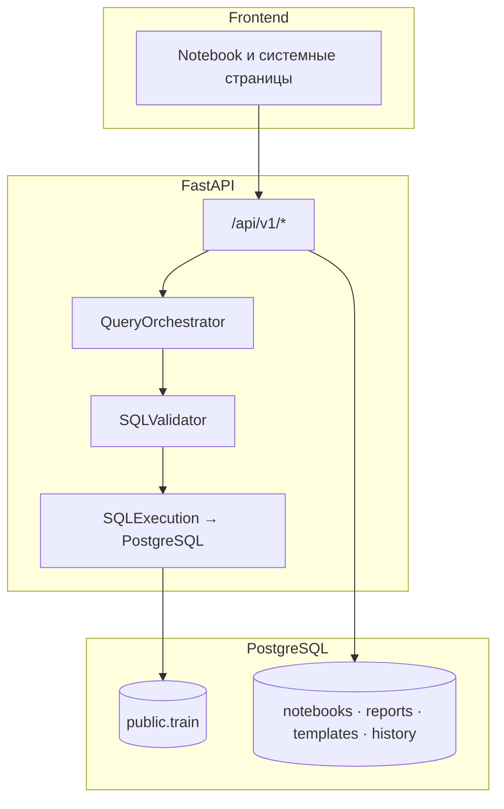

# Drivee Analytics Notebook

AI-first analytics платформа в формате notebook: от вопроса на естественном языке до SQL, таблиц, графиков, прогноза и explainability trace. Репозиторий упакован как **готовый к показу MVP** с реалистичным тестовым датасетом и прозрачным описанием границ продукта.

### Доступ: логины и пароль

После **`make seed`** или `python scripts/seed_demo_data.py` из каталога **`backend/`** на форме входа в поле email вводите адрес ниже. **Пароль для всех учётных записей:** `demo123`.

| Логин (email) | Роль |
|---------------|------|
| `admin@drivee.local` | admin |
| `manager@drivee.local` | manager |
| `marketer@drivee.local` | marketer |
| `executive@drivee.local` | executive |

Нюансы (старый bootstrap, обновление хеша пароля): [docs/demo-users-credentials.md](docs/demo-users-credentials.md).

**Документация:** [Архитектура](docs/architecture.md) · [Сценарий показа](docs/demo-script.md) · [Runbook для жюри (5 сценариев)](docs/jury-demo-runbook.md) · [Режимы и ограничения](docs/demo-defense.md) · [Набор данных](docs/demo-analytics-dataset.md) · [Контракты и runtime-режимы](docs/domain-contracts-and-runtime-modes.md) · [Roadmap улучшений](docs/improvement-roadmap.md) · [QA gate](docs/release-gate-checklist.md) · [Docker](DOCKER.md)

Карта документов (актуально):
- `README.md` — обзор продукта, архитектуры и команд запуска.
- `docs/jury-demo-runbook.md` — пошаговый прогон 5 сценариев для комиссии.
- `docs/demo-defense.md` — runtime-профили `Live / fallback / mock-only` и инженерно честные ограничения показа.

---

## 1) Название проекта

**Drivee Analytics Notebook** — платформа self-service аналитики с role-based интерфейсом, NL→SQL pipeline, guardrails и семантическим слоем.

## 2) Проблема

Команды бизнеса, продукта и маркетинга часто упираются в:

- долгий цикл «вопрос → аналитик → SQL → график → объяснение»;
- слабую прозрачность ответов AI;
- несогласованные метрики и словари;
- сложности с follow-up и контекстом диалога;
- разрыв между ad-hoc анализом и артефактами (отчёты, шаблоны, история).

## 3) Решение

Drivee объединяет:

- **Notebook UX** для аналитического workflow;
- **orchestration backend** (intent, semantics, SQL generation / validation / execution);
- **trace / explainability**;
- **role dashboards** и системные разделы (reports, history, templates, dictionary, data upload);
- **learning loop** через corrections.

## 4) Почему notebook сильнее chat-only

- Сохраняется **структура шагов** (prompt → SQL → table → chart → insight → forecast).
- Результат **воспроизводим** и пригоден для аудита.
- Можно **перезапускать** отдельные ячейки без потери контекста.
- Естественно ложатся **trace, guardrails, validation**.
- Упрощён переход к **отчётам и шаблонам**.

## 5) Что умеет MVP

| Область | Возможности |
|---------|-------------|
| **Аналитика в notebook** | Промпт на русском (и др.) → интерпретация intent → семантика → SQL → валидация → выполнение в PostgreSQL → таблица → рекомендация графика → инсайт; опционально baseline forecast sidecar. |
| **Данные** | Канонический аналитический источник **`public.train`** (VIEW над факт-таблицей заказов; те же колонки: `order_channel`, города, окна по датам); CSV upload → staging; DS-метрики и прогноз по рядам. |
| **Объём данных** | После `make seed` — тысячи синтетических строк `DEMO-*` (~9 недель, несколько городов и каналов); см. [demo-analytics-dataset.md](docs/demo-analytics-dataset.md). |
| **Роли** | Admin / Manager / Marketer / Executive — разные дашборды и ограничения SQL по роли (см. guardrails). |
| **Артефакты** | Ноутбуки и ячейки в БД; сохранённые отчёты (`saved_reports`), расписания у отчёта (`report_schedules`), каталог шаблонов (`query_templates`), история NL→SQL (`nl_queries_history`). |
| **Качество ответа** | Clarification при неоднозначности; числовой **confidence** в trace; follow-up с наследованием контекста. |
| **Защита** | SQL whitelist таблиц/колонок, лимиты, таймауты, запрет опасных паттернов; опционально mock-исполнение и клиентский fallback. |

**Метрики и сценарии (после выравнивания схемы):** `orders_count`, `tenders_count`, `client_cancellations`, `driver_cancellations`, `done_rides`, `avg_order_price`, `sum_order_price`, средние дистанция/длительность, конверсия, отмены до принятия, срезы по `city_id`, по дням, по `order_channel`, сравнение недель (шаблоны в seed).

## 6) Рабочие сценарии

| Сценарий | Где в UI | Что проверяется |
|----------|-----------|-----------------|
| Быстрый вопрос по операциям | `/scenarios` → `/notebooks/ops-health` | NL→SQL, таблица, график, trace, live или fallback. |
| Уточнение (clarification) | `/notebooks/clarification-demo` или явно двусмысленный промпт | Вопрос пользователю, опции, без «угадайки» SQL. |
| Follow-up в диалоге | `/notebooks/follow-up-demo` | Переписанный запрос, наследование фильтров/окна. |
| Сохранение отчёта и PDF | Ячейка ноутбука → `/reports` | `saved_reports`, скачивание PDF (в т.ч. локальные снимки при ограничениях). |
| Шаблоны | `/templates` | Каталог `query_templates`, запуск по шаблону (при совпадении контракта с backend). |
| История запросов | `/history` | Чтение истории (при live API — `GET /api/v1/history`; иначе возможен mock). |
| Роли и дашборды | `/dashboard/*` | Навигация и KPI-карточки (часть данных — тестовый уровень). |
| Словарь | `/dictionary` | Чтение терминов (backend: минимальный `meta/dictionary` или мок — см. ограничения). |
| Загрузка данных | `/data-upload` | Цепочка upload → import → staging. |
| Защита (режим жюри, 5 сценариев) | `/scenarios` → блок «Режим показа жюри» | One-click переходы по `demo_case`, стабильные trace/clarification/guardrails маркеры. |

Пошаговый сценарий экрана: **[docs/demo-script.md](docs/demo-script.md)**. Режимы Live/mock: **[docs/demo-defense.md](docs/demo-defense.md)**.

## 7) Роли пользователей

- **Admin** — governance, словарь/corrections, платформенные сценарии.
- **Manager** — ops / KPI, гео и SLA-вопросы.
- **Marketer** — заказы, отмены, завершения, цены по `city_id` / каналам.
- **Executive** — обзор KPI; SQL ограничен набором колонок для роли (см. `sql_validation_constants.py`).

**Логины и пароль** — см. блок в начале README; подробнее (bootstrap, caveats): [docs/demo-users-credentials.md](docs/demo-users-credentials.md).

## 8) Архитектура



Подробная схема этапов NL→SQL и ссылки на модули: **[docs/architecture.md](docs/architecture.md)**.

- `frontend/` — UI, notebook canvas, dashboards.
- `backend/` — API, оркестрация, валидация, персистентность.
- `backend/sql/` — bootstrap и вспомогательные SQL seed.

## 9) Как устроен NL → SQL pipeline

Упорядоченный поток (см. `QueryOrchestrator`, `docs/architecture.md`):

1. **Preprocessor** — нормализация строки.
2. **Dialogue** — определение follow-up, наследование контекста (`DialogueContextEngine`), при необходимости rewrite текста запроса.
3. **Intent** — классификация намерения и извлечение сущностей (окна времени, `city_id`, метрики и т.д.).
4. **Semantic resolution** — сопоставление с каноническими метриками и SQL-фрагментами (`SemanticService` + статический словарь + при seed — термины в БД для продукта/админки).
5. **Clarification** — если запрос неоднозначен, ветка уточнения **до** генерации финального SQL (`ClarificationEngine`).
6. **SQL generation** — сборка SELECT по intent, `source_table`, метрикам (`SQLGenerationService`).
7. **Corrections** — при наличии подходящего исправления в `query_corrections` возможна подмена SQL с пометкой в trace.
8. **Validation** — policy: whitelist таблиц (**`train`**, staging **`user_staging`** по паттерну из конфига), схем/колонок, запреты (в т.ч. `SELECT *` при настройке), обязательный LIMIT для части intent, проверка JOIN/рисков (`SQLValidatorService`).
9. **Execution** — PostgreSQL с таймаутом и лимитом строк либо mock (`SQLExecutionService`, `MOCK_MODE`).
10. **Chart recommendation** — эвристики по форме результата и intent (`ChartRecommendationService`).
11. **Insight + forecast** — LLM-инсайт с fallback; при необходимости sidecar прогноза по рядам.
12. **Trace** — единый payload для UI: SQL, validation, confidence, clarification, used tables/columns, forecast mode.

## 10) Как устроены guardrails

- **Whitelist** физических таблиц для пользовательского SQL: **`train`**, staging `user_staging.t_*` (паттерн из конфига); факт-хранилище под VIEW `train` не входит в whitelist и не фигурирует в NL→SQL. Детали: `app/core/config.py`, `sql_validation_constants.py`.
- **Роль** передаётся в валидатор: разные профили доступа к колонкам/таблицам.
- **Role-policy в NL-слое:** для `executive` и чувствительных сущностей действует whitelist метрик/полей до выполнения SQL; отказ объясняется в trace.
- **Лимиты** — `sql_default_limit`, обязательный LIMIT для ряда intent (`ranking`, `comparison`, …).
- **Таймаут** выполнения SQL в БД (`sql_timeout_seconds`).
- **Инъекции и риски** — парсинг и эвристики в `sql_trust` / validator (запрет DDL/DML, контроль опасных конструкций).
- **Rate limiting** промптов (guardrails в настройках).
- **Fallback** — `mock_sql_execution_fallback` и клиентский mock при ошибке API (интерфейс не «падает» молча).

При критической ошибке валидации выполнение не стартует; статус и предупреждения уходят в **trace**.

## 11) Как работает semantic layer

Два связанных контура:

1. **Runtime NL→SQL** — `SemanticService` сопоставляет текст запроса с известными метриками и отдаёт SQL-фрагменты для SELECT (расширяется паттернами и тестами). Используется внутри оркестратора до генерации SQL.
2. **Продуктовый словарь** — файл **`backend/app/data/semantic_dictionary.json`**: домены, метрики, синонимы, ограничения, примеры; используется семантическим слоем и документацией. UI `/dictionary` читает термины через API (в MVP возможны заглушка или мок — см. [ограничения](#24-ограничения-mvp)).

В БД при seed создаются **`semantic_terms` / синонимы** для основного контура (согласованность с onboarding и админскими сценариями).

Ограничения отображения словаря в UI см. в разделе **«Ограничения MVP»** ниже.

### Семантика `train`: канонические метрики → SQL-фрагмент → колонки

Источник правды для синонимов и примеров — **`backend/app/data/semantic_dictionary.json`**. Ниже — сжатая карта ключевых метрик (алиас в запросах — **`a`**). Колонок, которых нет в `train` (регион, тариф, название города и т.п.), в слое нет.

| Ключ метрики | SQL-выражение (фрагмент) | Колонки / смысл |
|--------------|---------------------------|-------------------|
| `train_row_count` | `COUNT(*)` | все строки выборки (заказ×тендер) |
| `orders_count` | `COUNT(*)` | то же число строк; для «уникальных заказов» см. `distinct_orders` |
| `distinct_orders` | `COUNT(DISTINCT a.order_id)` | `order_id` |
| `tenders_count` | `COUNT(DISTINCT a.tender_id)` | `tender_id` |
| `done_rides` | `COUNT(CASE WHEN a.driverdone_timestamp IS NOT NULL THEN 1 END)` | `driverdone_timestamp` |
| `done_conversion` | завершённые / `COUNT(*)` | см. notes в JSON |
| `client_cancellations` / `driver_cancellations` / `cancellations_total` | CASE по `clientcancel_timestamp` / `drivercancel_timestamp` / OR | соответствующие timestamp |
| `cancellation_rate` | отмены / `COUNT(*)` | как `cancellations_total` к числу строк |
| `sum_order_price` | `SUM(a.price_order_local)` | `price_order_local` |
| `avg_order_price` | `AVG(a.price_order_local)` | `price_order_local` |
| `avg_duration_seconds` | `AVG(a.duration_in_seconds)` | `duration_in_seconds` |
| `avg_distance_meters` | `AVG(a.distance_in_meters)` | `distance_in_meters` |

**Измерения (GROUP BY):** `city_id`, `order_channel`, `status_order`, `status_tender`, `offset_hours`; при необходимости техники — `user_id`, `driver_id` (для ролей вне admin/manager в SELECT действуют ограничения, см. `SQL_SENSITIVE_COLUMNS`).

**Период:** задаётся интерпретацией запроса (`order_timestamp`) и фильтрами вроде `previous_week` / `yesterday` (см. `SQLGenerationService._build_time_filter`).

Дополнение пустого словаря из кода: **`SemanticDictionaryStore.bootstrap_from_train()`** — кортеж **`_TRAIN_BOOTSTRAP_TERMS`** в `backend/app/services/semantic_layer/store.py` (синхронизирован с основными терминами `train`).

## 12) Как работают clarification и confidence

- **Clarification:** если извлечённые сущности и intent не позволяют однозначно выбрать метрику или измерение, pipeline возвращает **вопрос и варианты ответа**, флаг `clarification_requested=true`, SQL не выполняется до ответа пользователя.
- **Confidence:** числовая оценка (0–1) агрегирует уверенность по шагам (семантика, противоречия сущностей, полнота контекста); отображается в trace и ячейке. Низкая confidence **не заменяет** валидацию SQL, но сигнализирует риск.

## 13) Как сохраняются отчёты и шаблоны

| Сущность | Таблицы / API | Назначение |
|----------|----------------|------------|
| **Шаблоны** | `query_templates`, `GET/POST /api/v1/templates`, запуск `POST /api/v1/templates/{template_id}/run` | Типовые NL+SQL для роли и контекста данных; seed добавляет набор (в т.ч. `weekly_cancellations_by_city`, `wow_done_rides_by_city`, `conversion_by_channel`, …). |
| **Отчёты** | `saved_reports` (`report_payload_json`: SQL, тип графика и др.), `GET/POST/PATCH/DELETE /api/v1/reports` | Сохранённый снимок анализа, переиспользование и rerun. |
| **Расписание** | `report_schedules`, вложенные маршруты под **`/api/v1/reports/{id}/schedule`** | Периодическая отправка (MVP: доставка может быть упрощена/stub). |
| **История** | `nl_queries_history`, `GET /api/v1/history?workspace_id=` | Аудит запросов и промежуточных результатов. |

Ноутбук: `notebooks`, `notebook_cells`, `cell_runs` — полный след выполнения ячеек.

## 14) Smart visualization

После успешного выполнения SQL backend рекомендует тип графика (intent, форма данных, ключевые слова). Результат в trace (`chart_recommendation`) и в UI.

## 15) Context-aware dialogue и corrections

- **Follow-up:** движок определяет продолжение диалога, наследует фильтры и переписывает запрос для исполнения; в trace фиксируется `follow_up_context_used`.
- **Corrections:** админ фиксирует пару «было SQL → стало SQL»; при совпадении паттерна подстановка с меткой в trace.

## 16) Data Science layer, CSV, forecast

- **DS:** профилирование загрузок, агрегаты, прогноз, текстовые инсайты; связь с notebook workflow.
- **Правила честности рядов (forecast):** `orders_count` как `COUNT(DISTINCT order_id)` по дням; `done_rides` по `driverdone_timestamp`; `cancellations_total` без двойного счёта при двух timestamp; caps и winsorization — см. метаданные trace / `DS_METRIC_CAPS`.
- **Forecast-позиционирование:** в MVP это baseline sidecar по ряду SQL (с explainability и quality gate), а не полный production ML lifecycle с feature store/online serving.
- **CSV ingestion:** upload → preview → inferred schema → import job → staging → привязка к контексту notebook.
- **Единый слой для NL→SQL и ячеек:** при отсутствии явного `source_table` в контексте notebook оркестрация использует **`DS_DEFAULT_SOURCE_TABLE`** (по умолчанию `public.train`). Флаг **`DS_IMPLICIT_SOURCE_USE_LATEST_STAGING`** (по умолчанию `false`) отключает автоподстановку «последнего staging» после импорта CSV — иначе цифры могли бы расходиться между страницами без явного выбора источника. В снимок ячейки (`context_snapshot_json`) пишется `source_table` после разрешения контекста, чтобы отчёты и повторные прогоны оставались на том же поверхности. Карточки ролевых дашбордов по умолчанию показывают объёмы артефактов системы (ноутбуки, отчёты и т.д.), а не отдельный live-SQL KPI по `train`; согласованные KPI по данным заказов получаются через notebook, шаблоны и сохранённые отчёты на `train`.
- **Forecast:** horizon, baseline/low/high; в trace `forecast_mode`.

## 17) PostgreSQL: ключевые группы таблиц

- **Auth / контекст:** `users`, `roles`, `workspaces`, `workspace_memberships`
- **Notebook:** `notebooks`, `notebook_cells`, `cell_runs`
- **Обучение / аудит:** `query_corrections`, `generated_sql_logs`, `nl_queries_history`
- **Шаблоны и отчёты:** `query_templates`, `saved_reports`, `report_schedules`
- **Дашборды:** `dashboards`, `dashboard_widgets`
- **DS:** `uploaded_files`, `data_import_jobs`, `inferred_schemas`, `forecast_runs`, `forecast_results`
- **Канонический источник аналитики:** **`public.train`** (+ `order_channel`, см. bootstrap и [demo-analytics-dataset.md](docs/demo-analytics-dataset.md))

## 18) Маршруты frontend

- Auth: `/login`, `/register`
- После входа: `/notebooks` (обзор системы), список сценариев — `/scenarios`
- Dashboards: `/dashboard/admin|manager|marketer|executive` (блок KPI по **`public.train`**: `GET /api/v1/workspaces/{id}/dashboards/train-summary`)
- Notebook: `/scenarios`, `/notebooks/[id]`
- Система: `/reports`, `/history`, `/templates`, `/dictionary` (admin), `/corrections` (admin), `/data-upload`, `/settings`, `/forecast-lab`

## 19) Как запускать локально

### Вариант A — Docker (рекомендуется)

1. Скопировать env: `cp .env.example .env`, `cp backend/.env.example backend/.env` (см. **[DOCKER.md](DOCKER.md)**).
2. `docker compose up --build` — поднимутся frontend (**http://localhost:3000**), backend (**http://localhost:8000**), Postgres.
3. В типичном compose backend после ожидания Postgres выполняет **Alembic** и **idempotent seed** (см. entrypoint образа); при необходимости вручную: `make migrate`, **`make seed`**.
4. Frontend по умолчанию ходит на `http://localhost:8000`. Для режима с живым analytics не включайте принудительный мок аналитики (см. `docs/demo-defense.md`).

### Вариант B — без Docker

**Backend:**

```bash
cd backend
python3.11 -m venv .venv
source .venv/bin/activate
pip install -r requirements.txt
# PostgreSQL доступен локально; задать DATABASE_URL в backend/.env
uvicorn app.main:app --reload --port 8000
```

Применить `backend/sql/bootstrap_drivee.sql`, миграции `alembic upgrade head`, затем **`python scripts/seed_demo_data.py`**.

**Frontend:**

```bash
cd frontend
npm install
npm run dev
```

### Проверки качества

```bash
make test-smoke
make test-nl
make test-guardrails
make test-cov-core
make test-e2e         # отдельный browser gate (не обязательно в каждом CI-прогоне)
make test-e2e-quick   # быстрый smoke через Playwright storageState
cd frontend && npm run lint
```

Структура тестов: `tests/unit/`, `tests/integration/`, `tests/smoke/`; фикстуры рядов — `tests/fixtures/demo_orders.py`.

Рекомендуемая политика CI:

- обязательные deterministic gates: `make test-smoke`, `make test-nl`, `make test-guardrails`;
- browser e2e (`make test-e2e`) — отдельный release/demo gate;
- быстрый pre-demo smoke: `make test-e2e-quick`.

## 20) Настройка PostgreSQL вручную

1. Поднять PostgreSQL, создать БД и пользователя.
2. Прописать `DATABASE_URL` и связанные переменные в `backend/.env`.
3. Выполнить bootstrap и миграции (как в вашей ветке принято для деплоя).

## 21) Seed data

- `backend/sql/bootstrap_drivee.sql`, при необходимости `backend/sql/seed_demo.sql`.
- **`make seed`** или `docker compose run --rm backend python scripts/seed_demo_data.py` — роли, пользователи, контекст данных, семантика, **шаблоны**, ноутбук, отчёт, история защиты, **массовые заказы `DEMO-*`** ([demo-analytics-dataset.md](docs/demo-analytics-dataset.md)).
- Только бизнес-ряды: `python -m app.demo_data.seed_analytics_orders`.

## 22) Сценарии показа

Краткий чеклист: **[docs/demo-script.md](docs/demo-script.md)**.

Для реального прогона защиты используйте:
- **[docs/jury-demo-runbook.md](docs/jury-demo-runbook.md)** — последовательность 5 сценариев и команды перед показом;
- **[docs/demo-defense.md](docs/demo-defense.md)** — режимы Live/fallback/mock и формулировки инженерных ограничений.

## 23) Ограничения MVP

Коротко: это управляемые рамки зрелого MVP и controlled degradation (не скрываем, не маскируем).

- Детальный и актуальный список ограничений/режимов: **[docs/demo-defense.md](docs/demo-defense.md)**.
- План устранения ограничений: **[docs/improvement-roadmap.md](docs/improvement-roadmap.md)**.

## 24) Соответствие критериям оценки

Ниже — как текущий MVP закрывает типовые judging-критерии после упаковки (включая объёмный тестовый датасет и шаблоны WoW / конверсия по каналу).

### 1. Ценность для бизнеса (0–15)

Notebook сокращает путь от вопроса до ответа; шаблоны и словарь снижают порог входа; тестовые данные позволяют показать **сравнение городов, динамику по дням, недели, конверсию, топы** на реальном SQL.

### 2. Качество и реализуемость MVP (0–20)

End-to-end: промпт в `/notebooks/[id]` → валидация → Postgres → таблица и график; fallback не оставляет «пустой экран».

### 3. Точность NL → SQL (0–20)

Intent, сущности, семантика, follow-up; trace показывает, как система интерпретировала запрос.

### 4. Корректность SQL и данных (0–15)

Валидация до выполнения; в trace — `generated_sql`, `validation_status`, warnings, использованные таблицы/колонки.

### 5. Безопасность и guardrails (0–15)

Whitelist, роли, лимиты, таймауты; блокировка опасных запросов; основа для query governance в roadmap.

### 6. UX, explainability, визуализация (0–10)

Trace panel: intent, entities, semantic terms, SQL, validation, confidence, forecast; рекомендация графика.

### 7. Качество показа (0–5)

`/notebooks` (обзор) и `/scenarios` (список), сценарии защиты, честное описание live vs mock в `demo-defense.md` и §24 настоящего README.

### 8. Отчёты и расписания (0–5)

Модели и API отчётов и вложенного расписания; UI сохранения и списка отчётов.

### 9. Семантический слой (0–5)

Словарь JSON + runtime `SemanticService` + seed терминов контекста данных; страница `/dictionary` (режим зависит от контракта API).

### 10. Неоднозначность и confidence (0–5)

Clarification engine и числовой confidence в trace.

### 11. Шаблоны (0–5)

Таблица `query_templates`, экран `/templates`, расширенный набор SQL-шаблонов в seed (недели, каналы, отмены, конверсия).

---

## 25) Примеры кода, данных и графиков по критериям

### A. End-to-end: текстовый запрос → SQL → таблица → график

**Критерии:** 1, 2, 3, 4, 6

**NL (пример):** `Покажи количество отмен по city_id за прошлую неделю.`

**SQL (пример):**

```sql
SELECT
  city_id,
  COUNT(*) FILTER (
    WHERE clientcancel_timestamp IS NOT NULL
       OR drivercancel_timestamp IS NOT NULL
  )::bigint AS cancellations
FROM public.train
WHERE order_timestamp >= current_date - interval '7 day'
GROUP BY 1
ORDER BY 2 DESC;
```

### B. Guardrails

Пример заведомо рискованного SQL отклоняется валидатором; в trace — `validation_status: failed`, выполнение не стартует.

### C. Explainability trace

**Критерии:** 6, 10

```json
{
  "schema_version": 1,
  "interpreted_intent": "comparison · client_cancellations",
  "tables_used": ["train"],
  "validation_status": "passed",
  "confidence": 0.86,
  "clarification_requested": false,
  "follow_up_context_used": true,
  "learned_correction_used": false,
  "chart_recommendation": { "chart_type": "horizontal_bar" },
  "forecast_mode": { "active": false, "method": null }
}
```

### D. Clarification

**Критерии:** 3, 10

```json
{
  "clarification_requested": true,
  "clarification_question": "Уточните, какую метрику сравнить по city_id?",
  "clarification_options": [
    { "id": "orders_count", "label": "Количество заказов" },
    { "id": "client_cancellations", "label": "Отмены клиентом" },
    { "id": "avg_order_price", "label": "Средняя стоимость заказа" }
  ],
  "confidence": 0.56,
  "validation_status": "pending"
}
```

### E. Follow-up

**Критерии:** 3, 4, 10

```text
Q1: "Покажи количество отмен по city_id за 7 дней"
Q2: "а теперь только по city_id=101"
```

```json
{
  "follow_up_context_used": true,
  "rewritten_query_for_execution": "Покажи количество отмен по city_id=101 за 7 дней"
}
```

### F. Семантика (фрагмент)

| term_key | Пример SQL-агрегата |
|----------|---------------------|
| orders_count | `COUNT(*)` |
| done_rides | `COUNT(CASE WHEN driverdone_timestamp IS NOT NULL THEN 1 END)` |
| client_cancellations | по `clientcancel_timestamp` |
| avg_order_price | `AVG(price_order_local)` |

### G. Отчёты и шаблоны (примеры ключей после seed)

| template_key | Назначение |
|--------------|------------|
| `weekly_cancellations_by_city` | Отмены по городам за неделю |
| `daily_done_rides` | Завершённые поездки по дням (14d) |
| `wow_done_rides_by_city` | Завершённые: текущая vs прошлая неделя |
| `conversion_by_channel` | Конверсия по `order_channel` (28d) |
| `weekly_conversion` | Доля завершённых по неделям |
| `cancel_rate_by_city`, `avg_price_by_city`, `orders_dynamics`, … | См. `ensure_query_templates` в `scripts/seed_demo_data.py` |

### H. Forecasting (DS)

Ряды: `orders_count`, `done_rides`, `cancellations_total`, `sum_order_price` с caps и метаданными качества в trace.

---

## 26) Roadmap после MVP

**Инженерия и контракты (ближайшие итерации)** — см. фазы в [docs/improvement-roadmap.md](docs/improvement-roadmap.md): выравнивание History/Templates/Dictionary клиента с FastAPI, индикаторы live/mock, golden-тесты NL→SQL.

**Продукт и платформа (средний горизонт)**

- Production auth, политики RBAC end-to-end, аудит действий.
- Query cost governance, приоритеты очередей, квоты на тяжёлые SQL.
- Расширенный semantic layer: таксономия метрик, lineage, правила качества данных.
- Прогнозные модели и UI backtesting; наблюдаемость AI-pipeline (метрики, трейсы, стоимость LLM).
- Collaborative notebooks: комментарии, версии, шаринг по ссылке.
- CI/CD, нагрузочные и security-тесты оркестрации.

---

## Tech stack

- **Frontend:** Next.js 14, TypeScript, Tailwind, React Query, Recharts  
- **Backend:** FastAPI, SQLAlchemy 2, Pydantic  
- **DB:** PostgreSQL  
- **UX:** role-based dashboards + notebook-native analytics flow
