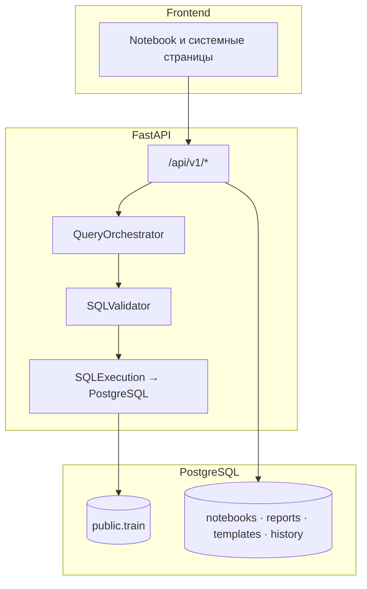
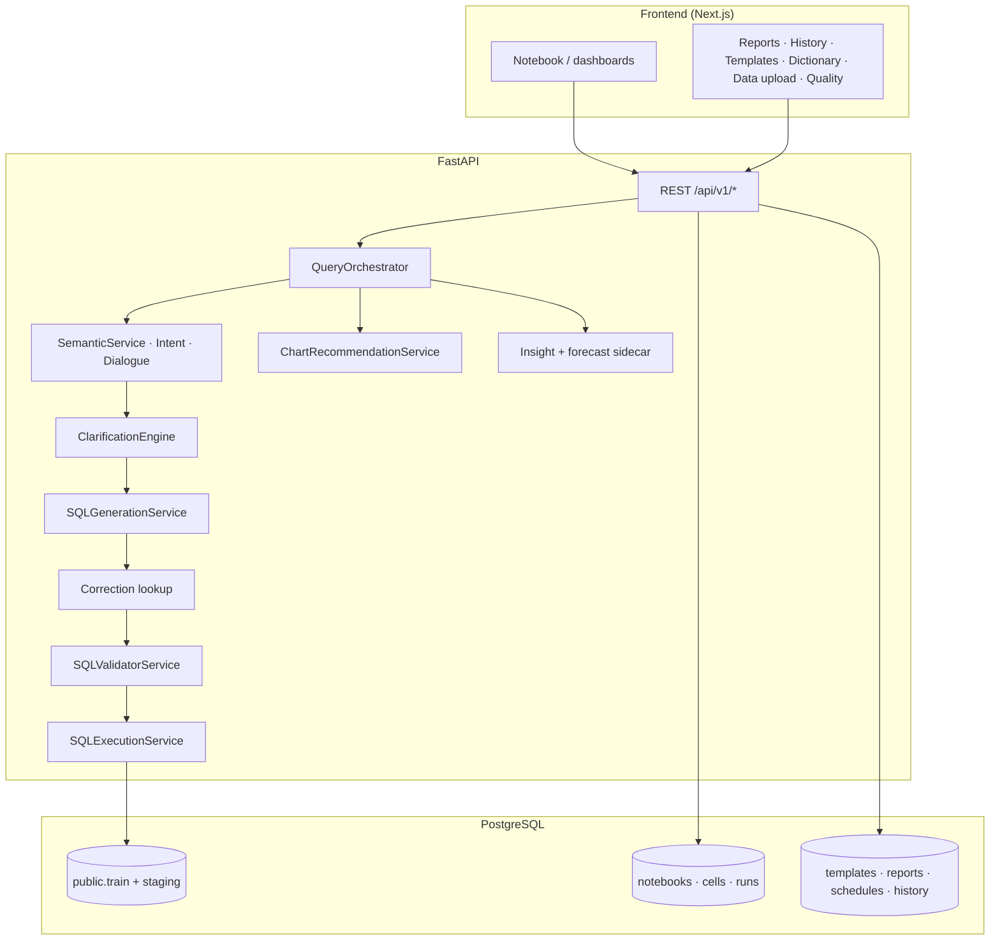

# Drivee Analytics AI

**Elevator pitch:** Drivee Analytics AI — это AI-платформа self-service аналитики, которая превращает вопрос на естественном языке в проверяемый SQL, исполняет его в PostgreSQL и возвращает **таблицу, рекомендованную визуализацию, текстовый инсайт, explainability trace и числовой confidence** — с возможностью сохранить результат как отчёт и продолжить диалог (follow-up, уточнения).

<p align="center">
  
</p>

| | |
|--|--|
| **Тема** | Self-service аналитика для команд продукта, операций и маркетинга без обязательного SQL. |
| **Для кого** | Non-tech пользователи, которым нужны ответы из данных **быстрее**, чем через очередь к аналитику, **прозрачнее**, чем «чёрный ящик» чата. |
| **Проблема** | Длинный цикл «вопрос → SQL → сверка метрик → график → объяснение», разъезжающиеся определения показателей, риск галлюцинаций у «голого» LLM. |
| **Бизнес-ценность** | Сокращение time-to-insight, единый семантический слой и guardrails снижают стоимость ошибок; notebook-артефакты и отчёты пригодны для аудита и повторного использования. |

---

## 1. Тема проекта

**Drivee Analytics AI** (продуктовое имя; репозиторий и UI также опираются на концепцию **Analytics Notebook**) — это управляемая среда аналитики, где пользователь формулирует бизнес-вопрос текстом, а платформа **оркестрирует полный контур**: интерпретация намерения → сопоставление с каноническими метриками и измерениями → генерация `SELECT` → валидация и политики безопасности → выполнение в БД → визуализация и объяснение.

**Что пользователь может сделать в MVP:**

- Задать вопрос на русском (и др.) в ячейке ноутбука и получить **таблицу результата**, **график** (рекомендация типа по форме данных и intent), **краткий инсайт**, **trace** (как система поняла запрос, какой SQL сгенерирован, статус валидации, confidence).
- Пройти **уточнение (clarification)** при неоднозначности вместо «угадывания» SQL.
- Продолжить **follow-up** в диалоге с наследованием фильтров и окна времени.
- Сохранить снимок анализа в **отчёты** (`/reports`), использовать **шаблоны** (`/templates`), смотреть **историю** (`/history`), **словарь** (`/dictionary`), загрузку CSV (`/data-upload`), **Quality Center** (`/quality`).
- Работать в **ролевых дашбордах** (admin / manager / marketer / executive) с разными профилями доступа к полям и SQL.

**Почему это «SQL IDE для non-tech», а не очередной чат:**

- Пользователь **не пишет SQL** и **не обязан знать схему** — система опирается на семантический слой (`SemanticService`, `semantic_dictionary.json`, термины в БД после seed).
- Результат оформлен как **воспроизводимый шаг ноутбука** (prompt → SQL → результат → trace), а не как поток сообщений без структуры.

**Чем отличается от классического SQL-редактора и от «просто ChatGPT»:**

| | Обычный SQL IDE | ChatGPT / generic LLM | Drivee Analytics AI |
|--|-----------------|----------------------|---------------------|
| Доступ non-tech | Нужен SQL и схема | Нет гарантий к вашей БД | NL → проверенный контур к **`public.train`** (и политикам роли) |
| Безопасность | Зависит от дисциплины | Нет встроенного guardrail к прод-данным | Whitelist таблиц/колонок, лимиты, таймауты, блокировка опасных паттернов |
| Объяснимость | Только комментарии аналитика | Текст без привязки к исполнению | **Trace**: intent, сущности, SQL, validation, confidence |
| Метрики | Расходятся между людьми | Галлюцинации имён колонок | Семантический слой и шаблоны после **seed** |

### Пример сквозного сценария (как на защите)

**Пользователь пишет:**  
«Покажи выручку по городам за прошлую неделю»

**Система:**

1. **Понимает бизнес-смысл** — intent сравнения/агрегации по географии и окну времени («прошлая неделя»).
2. **Сопоставляет термины** со словарём: «выручка» → каноническая метрика вроде **`sum_order_price`** (см. `semantic_dictionary.json` / bootstrap терминов), «города» → измерение **`city_id`**.
3. **Генерирует SQL** — `SELECT` по **`public.train`** с фильтром по времени (`order_timestamp`) и `GROUP BY city_id`.
4. **Проверяет безопасность** — валидатор (`SQLValidatorService`): разрешённые таблицы (**`train`**, staging по конфигу), политика роли, лимиты, запрет опасных конструкций.
5. **Выполняет запрос** в PostgreSQL (или controlled mock/fallback при деградации — см. `docs/demo-defense.md`).
6. **Показывает** интерактивную **таблицу**, **график** (рекомендация из `chart_recommendation` в trace), **инсайт** и **explainability trace** с **confidence**.

Техническая детализация этапов: [`docs/architecture.md`](docs/architecture.md), оркестратор: `QueryOrchestrator`.

---

## 2. Demo-доступ

Учётные записи создаются **идемпотентно** при **`make seed`** (или `docker compose run --rm backend python scripts/seed_demo_data.py`). На форме входа используется поле **email**.

**Рекомендуемый быстрый вход для демо:**

```text
Email: manager@drivee.local
Password: demo123
```

**Все демо-пользователи (тот же пароль `demo123`):**

| Email | Роль |
|-------|------|
| `admin@drivee.local` | admin |
| `manager@drivee.local` | manager |
| `marketer@drivee.local` | marketer |
| `executive@drivee.local` | executive |

Нюансы старых БД и обновления хеша пароля: [`docs/demo-users-credentials.md`](docs/demo-users-credentials.md).

---

## 3. Как запускать проект

### Требования

- **Docker** с поддержкой Compose v2 (`docker compose`), свободные порты на хосте (см. таблицу ниже).
- Для пути **без Docker:** Python **3.11**, **Node.js** (LTS), отдельно установленный **PostgreSQL 16** (или совместимый).

Подробности по переменным окружения, внешнему `train.csv`, pgAdmin и типичным сбоям: **[`DOCKER.md`](DOCKER.md)**.

### Вариант A — Docker (рекомендуется)

Из **корня репозитория**:

```bash
cp .env.example .env
cp backend/.env.example backend/.env
```

При необходимости скопируйте `frontend/.env.example` → `frontend/.env` (локальные переопределения фронта). Секреты и ключи LLM задаются в **`backend/.env`**; в Compose `DATABASE_URL` для backend подставляется на контейнер `postgres` автоматически.

Запуск всех сервисов:

```bash
docker compose up --build
```

При первом старте контейнер **backend** сам: ждёт готовности Postgres → **`alembic upgrade head`** → **`seed_demo_data.py`** (демо-пользователи и данные) → импорт `train.csv` (по умолчанию встроенный минимальный файл; большой датасет — см. `DOCKER.md`) → **uvicorn** на порту 8000. Frontend стартует **после** `healthcheck` backend, чтобы прокси `/api` не ловил `ECONNREFUSED`.

| Сервис | URL по умолчанию | Переменная порта в `.env` |
|--------|------------------|---------------------------|
| **Веб-интерфейс** | http://localhost:3001 | `FRONTEND_PORT` (внутри контейнера Next слушает 3000) |
| **API** | http://localhost:8000 | `BACKEND_PORT` |
| **PostgreSQL** | `localhost:5434` (с хоста → 5432 внутри сети compose) | `POSTGRES_PORT` |

Дальше откройте в браузере **http://localhost:3001** (или ваш `FRONTEND_PORT`), войдите учёткой из раздела [Demo-доступ](#2-demo-доступ). Точка входа после входа: **`/notebooks`** или **`/scenarios`**.

**Повторный seed без пересборки** (если меняли данные или нужно обновить демо):

```bash
make seed
# эквивалентно:
docker compose run --rm backend python scripts/seed_demo_data.py
```

**Миграции только:**

```bash
make migrate
```

**Проверка стенда перед демо** (поднимает compose в фоне, ждёт `/health`, печатает URL):

```bash
make demo-live
```

См. также [`docs/DEMO_LIVE_RUNBOOK.md`](docs/DEMO_LIVE_RUNBOOK.md).

**Остановка:**

```bash
docker compose down
```

Если после `docker compose restart` фронт поднялся раньше backend и отдаёт 500 на `/api`, используйте **`make restart-stack`** (остановка фронта, рестарт postgres+backend, подъём фронта).

### Вариант B — без Docker

<a id="local-no-docker"></a>

Нужен **доступный PostgreSQL** и строка **`DATABASE_URL`** в `backend/.env` (как в `backend/.env.example`).

**1. База и схема**

- Создайте БД и пользователя.
- Выполните bootstrap: `backend/sql/bootstrap_drivee.sql` (как принято в вашей среде — через `psql` или админку).
- Из каталога `backend/`:

```bash
source .venv/bin/activate   # после создания venv и pip install -r requirements.txt
alembic upgrade head
python scripts/seed_demo_data.py
```

**2. Backend**

```bash
cd backend
python3.11 -m venv .venv
source .venv/bin/activate   # Windows: .venv\Scripts\activate
pip install -r requirements.txt
uvicorn app.main:app --reload --host 0.0.0.0 --port 8000
```

**3. Frontend** (отдельный терминал)

```bash
cd frontend
npm install
```

Если API крутится на `http://localhost:8000`, задайте в `frontend/.env` или в окружении **`NEXT_PUBLIC_API_URL=http://localhost:8000`** и убедитесь, что origin фронта (например `http://localhost:3000`) указан в **`CORS_ORIGINS`** / `BACKEND_CORS_ORIGINS` backend. Иначе оставьте прокси как в Docker: смотрите `frontend/.env.example`.

```bash
npm run dev
```

Откройте URL, который выводит Next (часто **http://localhost:3000**).

---

## 4. Ключевые возможности MVP

| Область | Возможности |
|---------|-------------|
| **Notebook** | NL → intent → семантика → SQL → валидация → PostgreSQL → таблица, график, инсайт; опционально baseline **forecast**; trace и **confidence**. |
| **Данные** | Канонический источник **`public.train`** (VIEW над факт-таблицей заказов); CSV upload → staging; расширенные таблицы Drivee после импорта (см. [`docs/datasets/drivee-analytics-base-ru.md`](docs/datasets/drivee-analytics-base-ru.md)). |
| **Объём demo** | После seed — тысячи строк `DEMO-*`, несколько городов и каналов, окна по датам; подробнее: [`docs/demo-analytics-dataset.md`](docs/demo-analytics-dataset.md). |
| **Роли** | Разные дашборды и ограничения SQL по роли. |
| **Артефакты** | Ноутбуки и ячейки в БД; **saved reports**; **query templates**; **nl_queries_history**. |
| **Качество** | **Drivee Quality Center** (`/quality`), golden suite NL→SQL, см. [`docs/evaluation_guide.md`](docs/evaluation_guide.md). |

---

## 5. Сценарии для жюри и навигация

| Сценарий | Где в UI |
|----------|-----------|
| Операционная аналитика | `/scenarios` → `/notebooks/ops-health` |
| Clarification | `/notebooks/clarification-demo` или двусмысленный промпт |
| Follow-up | `/notebooks/follow-up-demo` |
| Отчёты, PDF | ячейка → `/reports` |
| Шаблоны | `/templates` |
| История | `/history` |
| Режим 5 сценариев | `/scenarios` → блок «Режим показа жюри» |
| Quality Center | `/quality` |

Пошагово: [`docs/jury-demo-runbook.md`](docs/jury-demo-runbook.md) · [`docs/demo-script.md`](docs/demo-script.md) · честные режимы live/mock: [`docs/demo-defense.md`](docs/demo-defense.md).

---

## 6. Архитектура

Система строится как **три крупных контура** — клиент (Next.js), API (FastAPI) и PostgreSQL — с явным разделением **аналитических данных** (`public.train` и политика staging) и **артефактов приложения** (ноутбуки, отчёты, шаблоны, история). Запрос пользователя из UI **никогда** не обращается к оркестратору напрямую: браузер вызывает маршруты **`/api/v1/*`**, а уже внутри backend создаётся цепочка сервисов; для notebook-ячейки критический путь — **`POST /api/v1/analytics/run`** → `analytics_pipeline.run_pipeline_with_analysis` → **`QueryOrchestrator`**.

**Слои репозитория (краткая карта):**

| Слой | Где в коде |
|------|------------|
| UI | `frontend/app/(platform)/`, `frontend/components/notebook/` |
| HTTP-клиент | `frontend/lib/api/` |
| Роуты API | `backend/app/api/routes/` (`router.py` собирает префикс `/api/v1`) |
| Склейка аналитики | `backend/app/services/analytics_pipeline.py` |
| NL→SQL | `backend/app/services/orchestration/` (`query_orchestrator.py` — точка сборки) |
| Валидация SQL | `backend/app/services/sql_validation/` |
| Guardrails по промпту/роли | `backend/app/services/guardrails/` |
| Семантика | `backend/app/services/semantic_layer/`, `backend/app/data/semantic_dictionary.json` |

### Обзорная схема (три подсистемы)



### Внутренний разрез API и оркестрации



**Основные маршруты frontend:** `/login`, `/register` → `/notebooks`, `/scenarios`, `/notebooks/[id]`, `/dashboard/admin|manager|marketer|executive`, `/reports`, `/history`, `/templates`, `/dictionary`, `/corrections`, `/data-upload`, `/settings`, `/forecast-lab`, `/quality`, `/semantic-dictionary`.

Полное пошаговое описание pipeline, таблица HTTP-ручек, группы таблиц БД и границы системы: **[`docs/architecture.md`](docs/architecture.md)**.

---

## 7. NL → SQL pipeline

Ниже — логическая последовательность того, что выполняет **`QueryOrchestrator`** (детали ветвлений, кэш и аудит — в `docs/architecture.md`, §7).

1. **Препроцессинг** текста запроса.  
2. **Диалог** — `DialogueContextEngine`: follow-up, наследование контекста ноутбука, при необходимости переписывание текста для исполнения.  
3. **Intent** — `IntentService`: намерение и сущности (окно времени, `city_id`, метрики и т.д.).  
4. **Semantic resolution** — `SemanticService` / парсер + `semantic_dictionary.json` (и термины БД после seed): канонические метрики и SQL-фрагменты.  
5. **Clarification** — `ClarificationEngine`: при неоднозначности — вопрос пользователю, без выполнения финального SQL.  
6. **Генерация SQL** — `SQLGenerationService`.  
7. **Corrections** — `CorrectionLearningService`: подстановка исправлений админа с отметкой в trace.  
8. **Guardrails (NL)** — rate limit, злоупотребление промптом, политика роли по метрикам и сущностям (`guardrails/policy_engine.py`).  
9. **Валидация SQL** — `SQLValidatorService` + `sql_trust`: whitelist таблиц (**`train`**, staging **`user_staging`**), колонки, лимиты, запреты.  
10. **Исполнение** — `SQLExecutionService`: PostgreSQL или mock/fallback по конфигурации.  
11. **Постобработка** результата для UI (`analytics_post_process`).  
12. **График** — `ChartRecommendationService`.  
13. **Инсайт и опционально forecast** — insight-сервис и baseline sidecar из `ds/`.  
14. **Trace и confidence** — explainability payload и аудит события (`_audit_emit`).

---

## 8. Guardrails и семантика

- Разрешённые пользовательские таблицы: **`train`**, staging `user_staging` по паттерну из конфигурации; детали: `app/core/config.py`, `sql_validation_constants.py`.
- Роли ограничивают доступ к чувствительным колонкам и наборам метрик (в т.ч. executive).
- Семантика: `backend/app/data/semantic_dictionary.json` + `SemanticService` + термины в БД после seed.

---

## 9. Локальная разработка

Пошаговый запуск без Docker: **[§3, вариант B](#local-no-docker)**.

---

## 10. Тесты и качество

```bash
make test-smoke
make test-nl
make test-guardrails
make test-cov-core
make test-e2e-quick   # быстрый pre-demo smoke
make test-e2e         # полный browser gate
make quality-eval
```

---

## 11. Seed и импорт данных

- **`make seed`** — пользователи, контекст, семантика, шаблоны, ноутбук, массовые заказы `DEMO-*`.
- Только бизнес-ряды без полного сида: `python -m app.demo_data.seed_analytics_orders` (из контейнера/venv backend).
- Импорт расширенного набора Drivee (после `alembic upgrade head` доступны `incity_orders`, `passenger_daily_metrics`, `driver_daily_metrics`) — см. схему в [`docs/datasets/drivee-analytics-base-ru.md`](docs/datasets/drivee-analytics-base-ru.md). Пример:

```bash
docker compose exec backend python scripts/import_drivee_dataset.py \
  --incity /data/incity.csv --replace-incity \
  --pass-detail /data/pass_detail.csv --replace-pass \
  --driver-detail /data/driver_detail.csv --replace-driver
```

---

## 12. Скриншоты

Добавьте изображения в `docs/screenshots/` и обновите ссылки ниже (сейчас — плейсхолдеры для подготовки презентации).

| Файл | Что показать |
|------|----------------|
| `./docs/screenshots/logo.png` | **TODO:** логотип продукта |
| `./docs/screenshots/01-login.png` | **TODO:** форма входа (email + пароль) |
| `./docs/screenshots/02-notebook-prompt.png` | **TODO:** ячейка с NL-запросом |
| `./docs/screenshots/03-table-chart-trace.png` | **TODO:** таблица, график, панель trace / confidence |
| `./docs/screenshots/04-clarification.png` | **TODO:** сценарий уточнения |
| `./docs/screenshots/05-reports.png` | **TODO:** сохранённый отчёт |
| `./docs/screenshots/06-quality-center.png` | **TODO:** Quality Center |

---

## 13. Ограничения MVP и roadmap

Инженерно честные границы показа (live / fallback / mock): [`docs/demo-defense.md`](docs/demo-defense.md).  
План развития: [`docs/improvement-roadmap.md`](docs/improvement-roadmap.md).  
Архитектура и контракты: [`docs/domain-contracts-and-runtime-modes.md`](docs/domain-contracts-and-runtime-modes.md).

---

## 14. Tech stack

- **Frontend:** Next.js 14, TypeScript, Tailwind, React Query, Recharts  
- **Backend:** FastAPI, SQLAlchemy 2, Pydantic  
- **БД:** PostgreSQL  

---

## 15. Документация (карта)

| Документ | Назначение |
|----------|------------|
| [`docs/architecture.md`](docs/architecture.md) | Архитектура и модули |
| [`docs/jury-demo-runbook.md`](docs/jury-demo-runbook.md) | 5 сценариев для комиссии |
| [`docs/demo-defense.md`](docs/demo-defense.md) | Режимы runtime и ограничения |
| [`docs/demo-analytics-dataset.md`](docs/demo-analytics-dataset.md) | Демо-данные |
| [`docs/jury_quality_center_pitch.md`](docs/jury_quality_center_pitch.md) | Питч Quality Center |
| [`DOCKER.md`](DOCKER.md) | Docker и переменные окружения |
