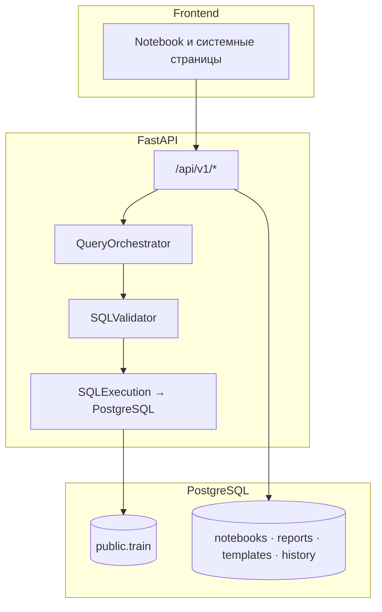
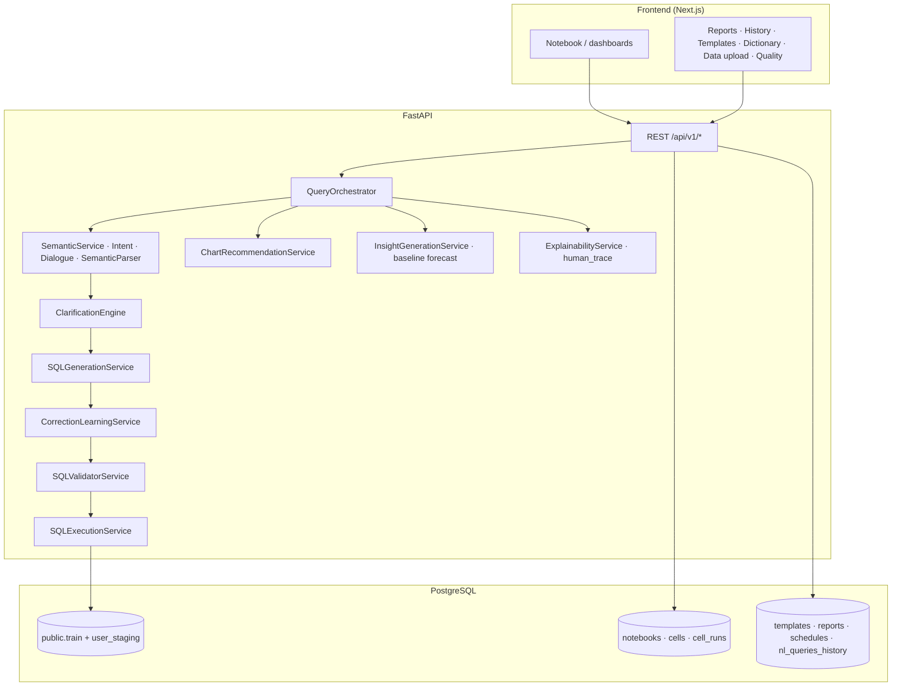

# Архитектура Drivee Analytics AI / Analytics Notebook

Документ описывает **сквозную архитектуру** продукта: клиент, HTTP API, оркестрация NL→SQL, guardrails, персистентность и основные потоки данных. Он дополняет [`README.md`](../README.md) (обзор для жюри) и не дублирует чеклисты демо — для режимов показа см. [`demo-defense.md`](./demo-defense.md), для контрактов API и mock/live — [`domain-contracts-and-runtime-modes.md`](./domain-contracts-and-runtime-modes.md).

---

## 1. Контекст и границы системы

**В зоне ответственности платформы**

- Приём запроса на естественном языке из notebook-ячейки (и сопутствующих сценариев UI).
- Интерпретация намерения, семантическое сопоставление с каноническими метриками, генерация **одного** читаемого `SELECT` (или ветка clarification без выполнения).
- Валидация SQL по политике (whitelist таблиц/колонок, роль, лимиты, эвристики безопасности).
- Выполнение в PostgreSQL (или контролируемый mock/fallback при конфигурации).
- Формирование ответа: таблица, рекомендация графика, инсайт, опционально baseline-прогноз, **единый explainability trace** и **confidence**.
- Сохранение артефактов: ноутбуки, ячейки, прогоны, отчёты, шаблоны, история NL→SQL, аудит guardrails.

**За пределами одного репозитория (типично)**

- Корпоративный SSO / production IAM (в MVP — JWT и демо-пользователи).
- Внешняя очередь тяжёлых SQL, отдельный warehouse (Clickhouse и т.д.) — в текущей модели аналитика опирается на **PostgreSQL**.
- Полный MLOps lifecycle (в MVP forecast — baseline sidecar с quality gate в trace).

---

## 2. Физическая топология

```text
Браузер
   │  HTTPS (dev: HTTP)
   ▼
Next.js (App Router) — порт на хосте задаётся FRONTEND_PORT (часто 3001 → контейнер 3000)
   │  same-origin BFF-прокси к API или NEXT_PUBLIC_API_URL → FastAPI :8000
   ▼
FastAPI (uvicorn) — префикс API `/api/v1`
   │
   ├── JWT + зависимости `app/api/deps.py`
   ├── маршруты `app/api/routes/*.py`
   └── сервисы `app/services/*`
   ▼
PostgreSQL — аналитический VIEW `public.train`, факт-хранилище под VIEW, артефакты приложения
```

Docker-сборка и переменные окружения: корневой [`DOCKER.md`](../DOCKER.md).

---

## 3. Слои и ответственность (сводная таблица)

| Слой | Расположение в репозитории | Роль |
|------|----------------------------|------|
| **Клиент** | `frontend/app/`, `frontend/components/`, `frontend/lib/` | Notebook canvas, ячейки (таблица, график, trace, clarification), дашборды по ролям, системные страницы (отчёты, шаблоны, история, словарь, загрузка CSV, Quality Center). |
| **Контракты API** | `frontend/lib/api/*.ts`, `frontend/types/api/` | Типизированные вызовы к `/api/v1/*`, режимы live / mock / fallback через `frontend/lib/api/config.ts`. |
| **HTTP API** | `backend/app/api/router.py`, `backend/app/api/routes/` | Маршрутизация, зависимости, схемы Pydantic в `backend/app/schemas/`. |
| **Склейка аналитики** | `backend/app/services/analytics_pipeline.py` | Вызов `QueryOrchestrator`, постобработка результата, сбор trace для UI, интеграция с `NotebookService`. |
| **Оркестрация NL→SQL** | `backend/app/services/orchestration/` | Единый pipeline от текста до `OrchestrationOutput` (см. §6). |
| **Валидация SQL** | `backend/app/services/sql_validation/` | Парсинг доверия, правила, `SQLValidatorService`. |
| **Guardrails NL** | `backend/app/services/guardrails/` | Rate limit, злоупотребление промптом, role policy по метрикам/сущностям, аудит `log_query_audit_event`. |
| **Семантика** | `backend/app/services/semantic_layer/`, `backend/app/data/semantic_dictionary.json` | Канонические метрики, синонимы, bootstrap терминов для `train`. |
| **LLM** | `backend/app/services/llm/` | Фабрика провайдера; intent/insight и др. вызываются из оркестрации и смежных сервисов. |
| **DS / прогноз** | `backend/app/services/ds/` | Baseline forecast sidecar, связь с рядами из SQL. |
| **Данные** | `backend/app/models/`, `backend/app/repositories/`, Alembic | ORM-сущности, доступ к БД, миграции. |

---

## 4. Обзорная схема (три подсистемы)

Упрощённый поток «кто с кем говорит» — удобен для слайдов и README.



**Пояснение:** фронтенд не вызывает `QueryOrchestrator` напрямую — запрос идёт в маршруты `R`, а оркестратор создаётся внутри цепочки сервисов (типично через `run_pipeline_with_analysis` в `analytics_pipeline.py`). Связь `R --> ART` отражает те же HTTP-ручки, которые читают и пишут ноутбуки, отчёты, шаблоны и историю, параллельно аналитическому прогону.

---

## 5. Детальная схема NL→SQL и сопутствующих сервисов

Внутренний разрез слоя API и оркестрации (имена файлов — ориентир для чтения кода).



---

## 6. Поверхность HTTP API (`/api/v1`)

Корневой роутер: `backend/app/api/router.py`. Ниже — логические группы (префиксы могут собираться в подроутерах; уточняйте в `routes/*.py`).

| Область | Назначение | Файлы маршрутов (ориентир) |
|---------|------------|----------------------------|
| Здоровье | `/health`, готовность демо | `health.py`, `demo_readiness.py` |
| Аутентификация | регистрация, логин, JWT | `auth.py` |
| Ноутбуки | CRUD ноутбуков, ячеек, запуск | `notebooks.py` |
| **Аналитика** | **`POST .../analytics/run`** — главная точка NL→SQL из UI | `analytics.py` |
| Дашборды | сводки по роли / train | `dashboards.py` |
| Данные и прогноз | загрузка, import jobs, forecast API | `data_layer.py` |
| Мета / словарь | справочная информация для UI | `meta.py`, `dictionary.py` |
| Админка | коррекции SQL, политика SQL | `admin_corrections.py`, `admin_sql_policy.py` |
| Отчёты и шаблоны | сохранённые отчёты, расписания, шаблоны | `reports.py`, `templates_api.py` |
| История | аудит NL-запросов | `history.py` |
| Оценка качества | Quality Center, golden / correctness | `evaluation_*.py`, `quality_center_alias.py` |

Критический путь notebook-ячейки: клиент вызывает **`POST /api/v1/analytics/run`** → `run_analytics` → `run_pipeline_with_analysis` → **`QueryOrchestrator`** (`query_orchestrator.py`).

---

## 7. Оркестрация: этапы pipeline

Логика сосредоточена в `QueryOrchestrator` (`backend/app/services/orchestration/query_orchestrator.py`). Номера этапов условны — в коде часть шагов объединена или идёт ветвлением (clarification / guardrail block).

1. **Препроцессинг** — нормализация текста, подготовка к intent (внутри оркестратора и `IntentService`).
2. **Диалог** — `DialogueContextEngine`: follow-up, наследование контекста ноутбука, при необходимости переписывание запроса для исполнения.
3. **Intent** — `IntentService`: классификация намерения, извлечение сущностей (окно времени, `city_id`, метрики и т.д.).
4. **Семантика** — `SemanticService`, `SemanticParser`, словарь `semantic_dictionary.json` и термины БД после seed: сопоставление бизнес-терминов с каноническими метриками и SQL-фрагментами.
5. **Clarification** — `ClarificationEngine`: при неоднозначности возвращается вопрос и варианты, финальный SQL не выполняется до ответа пользователя.
6. **Генерация SQL** — `SQLGenerationService`: сборка `SELECT` по intent, источнику данных и политике роли.
7. **Коррекции** — `CorrectionLearningService`: при совпадении с зарегистрированной парой «было → стало» возможна подстановка SQL с отметкой в trace.
8. **Guardrails (NL)** — `guardrails/policy_engine.py` и связанные проверки: rate limit, злоупотребление, оценка сущностей и канонической метрики для роли (`evaluate_entities_for_role`, `evaluate_canonical_metric_for_role`).
9. **Валидация SQL** — `SQLValidatorService` (`sql_validation/validator_service.py`) совместно с `sql_trust.py`: whitelist таблиц (**`train`**, staging **`user_staging`** по конфигу), колонки, запреты, лимиты.
10. **Исполнение** — `SQLExecutionService`: PostgreSQL с таймаутом и лимитом строк, либо mock при `MOCK_MODE` / ошибках согласно конфигурации.
11. **Постобработка результата** — `analytics_post_process.py`: приведение типов, ограничения выдачи для UI.
12. **График** — `ChartRecommendationService`: эвристики по форме результата и intent.
13. **Прогноз (опционально)** — `run_baseline_forecast_sidecar` при явном запросе прогноза / режиме `forecast_sidecar`.
14. **Инсайт и explainability** — после прогноза два независимых обращения к LLM (`InsightGenerationService.generate`, `ExplainabilityService.generate`) выполняются **параллельно** (`ThreadPoolExecutor`), чтобы задержка была порядка **одного** сетевого round-trip к провайдеру, а не двух подряд. Затем сбор `human_trace` / `trace_payload`.

После успешного или неуспешного прогона вызывается **`_audit_emit`** — событие в аудит guardrails (`nl_query_succeeded`, `nl_query_guardrails_block`, и т.д.).

Кэширование повторяющихся NL→SQL: `app/services/cache/query_result_cache.py` (ключи и политика включения — в настройках и оркестраторе).

---

## 8. Валидация и «доверие к SQL»

| Компонент | Файл | Назначение |
|-----------|------|------------|
| Основной валидатор | `sql_validation/validator_service.py` | Центральная точка проверки сгенерированного SQL. |
| Эвристики доверия | `sql_validation/sql_trust.py` | Паттерны риска (инъекции, опасные конструкции). |
| Утилиты | `sql_validation/utils.py`, `effective_sql_settings.py` | Вспомогательная логика и эффективные лимиты. |
| Константы whitelist | `backend/app/core/sql_validation_constants.py` (и конфиг `Settings`) | Таблицы, чувствительные колонки, правила по ролям. |

Политика ролей на уровне **метрик и полей до SQL** дополняет SQL-валидатор и отражается в trace для прозрачности для жюри и бизнеса.

---

## 9. Клиентское приложение (Next.js)

| Зона | Путь | Содержание |
|------|------|------------|
| Маршруты платформы | `frontend/app/(platform)/` | Ноутбуки, сценарии, отчёты, дашборды, `/quality`, `/data-upload`, … |
| Auth | `frontend/app/(auth)/` | Логин и регистрация. |
| API-клиент | `frontend/lib/api/` | Обёртки над `/api/v1`, единая обработка ошибок и mock. |
| Notebook | `frontend/components/notebook/` | Canvas, ячейки, графики, trace, clarification, forecast. |
| Навигация | `frontend/lib/navigation/config.ts` | Ролевое меню и доп. маршруты (Quality Center, Forecast Lab). |

Режимы **`NEXT_PUBLIC_API_MOCK`**, **`NEXT_PUBLIC_DEMO_MODE`** и принудительный мок аналитики задают поведение при сбоях сети и на стенде без backend — без скрытия деградации (см. `demo-defense.md`).

---

## 10. PostgreSQL: логические группы таблиц

| Группа | Примеры сущностей | Назначение |
|--------|-------------------|------------|
| Пользователи и доступ | `users`, `roles`, `workspaces`, `workspace_memberships` | JWT, рабочее пространство, роль. |
| Аналитика заказов | Факт-таблица + **`public.train`** (VIEW) | Канонический источник NL→SQL в MVP; колонки и объём demo — `demo-analytics-dataset.md`. |
| Staging | `user_staging.*` | После CSV-import; допускается в whitelist по паттерну конфига. |
| Notebook | `notebooks`, `notebook_cells`, `cell_runs` | Персистентность ячеек и прогонов. |
| Обучение и аудит | `query_corrections`, `generated_sql_logs`, `nl_queries_history` | Коррекции, логи, история запросов. |
| Продуктовые артефакты | `query_templates`, `saved_reports`, `report_schedules` | Шаблоны и отчёты. |
| DS | `uploaded_files`, `data_import_jobs`, `forecast_runs`, … | Загрузки и прогнозы. |

Расширенный набор таблиц Drivee/MPIT (`incity_orders`, дневные метрики) описан в [`datasets/drivee-analytics-base-ru.md`](./datasets/drivee-analytics-base-ru.md).

---

## 11. Задержка ответа на промпт (что занимает время)

При включённом LLM (`LLM_PROVIDER=deepseek` и валидный ключ) основная задержка — **синхронные HTTP-вызовы** к API модели, каждый с таймаутом **`LLM_TIMEOUT_SECONDS`** (по умолчанию 45 с, см. `backend/.env.example`).

| Этап | Типичный вклад |
|------|-----------------|
| **`interpret_user_query`** | Один вызов в начале цепочки (`IntentService._get_llm_interpretation`); результат кэшируется в рамках одного запроса для `classify_intent` и `extract_entities`. |
| **Инсайт + explainability** | Два вызова после SQL и графика; **выполняются параллельно**, итоговая задержка ≈ **max** из двух, не сумма. |
| **Провайдер** | У DeepSeek до 2 повторов при ошибке с короткой паузой `0.25 * (attempt + 1)` с (`deepseek_provider.py`). |
| **SQL** | Ограничен `sql_timeout_seconds` (по умолчанию 8 с) на стороне Postgres. |
| **Клиент** | В notebook UI таймаут ожидания ответа аналитики задаётся большим значением (`ANALYTICS_TIMEOUT_MS` в `frontend/.../notebooks/[id]/page.tsx`), чтобы не обрывать длинные LLM. |

Если LLM отключён (`LLM_PROVIDER` пустой / без ключа), intent и сущности определяются эвристиками, инсайт и explainability уходят в **детерминированные fallback** — ответ обычно приходит за сотни миллисекунд плюс время SQL.

---

## 12. Связанные документы

| Документ | Зачем читать |
|----------|----------------|
| [`README.md`](../README.md) | Обзор продукта, demo-доступ, сценарии жюри, запуск. |
| [`demo-defense.md`](./demo-defense.md) | Live / fallback / mock, формулировки ограничений для комиссии. |
| [`domain-contracts-and-runtime-modes.md`](./domain-contracts-and-runtime-modes.md) | Контракты API и runtime-режимы. |
| [`demo-analytics-dataset.md`](./demo-analytics-dataset.md) | Демо-данные `DEMO-*` и окна по датам. |
| [`improvement-roadmap.md`](./improvement-roadmap.md) | Инженерные разрывы и план закрытия. |
