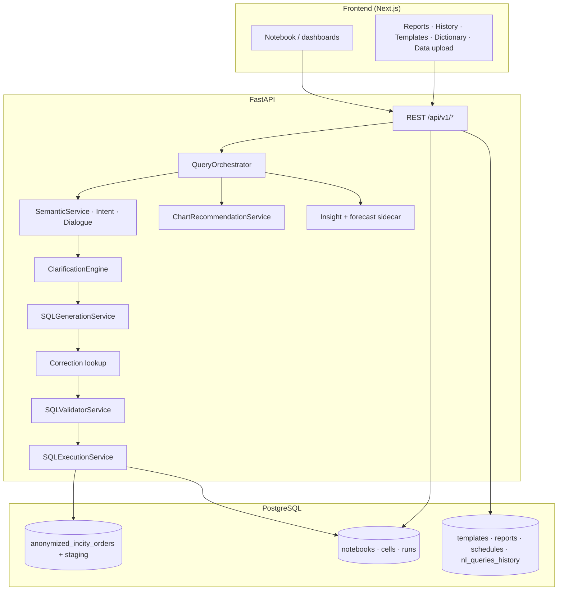

# Архитектура Drivee Analytics Notebook

Высокоуровневая схема для защиты MVP и онбординга. Детали контрактов API и разрывов UI ↔ backend см. в [`improvement-roadmap.md`](./improvement-roadmap.md).

## Компоненты

| Слой | Технологии | Ответственность |
|------|------------|-----------------|
| Клиент | Next.js 14 (App Router), TypeScript, Tailwind, React Query | Notebook, дашборды, системные страницы, trace panel, режимы live/mock/fallback |
| API | FastAPI, Pydantic | JWT, notebooks/cells/run, `POST /analytics/run`, data upload, forecast, reports, templates, history, admin corrections |
| Оркестрация | Сервисы в `app/services/orchestration/`, `sql_validation/`, `semantic_layer/` | NL→SQL pipeline, guardrails, explainability |
| Данные | PostgreSQL, SQLAlchemy | Каноническая факт-таблица `anonymized_incity_orders`, артефакты notebook, отчёты, шаблоны, история |

## Схема потоков

## NL → SQL (логические этапы)

1. Препроцессинг текста запроса.  
2. Диалог: follow-up, наследование контекста (`DialogueContextEngine`).  
3. Intent + извлечение сущностей (`IntentService`).  
4. Семантика: сопоставление метрик/терминов (`SemanticService` + словарь).  
5. Clarification: нужен ли вопрос пользователю, черновой confidence.  
6. Генерация SQL (+ опционально learned correction).  
7. Валидация (whitelist, запреты, лимиты, роль).  
8. Выполнение в Postgres или mock-режиме.  
9. Рекомендация графика, инсайт, опционально forecast.  
10. Сбор trace и ответ клиенту.

Кодовая точка входа: `QueryOrchestrator` (см. `backend/app/services/orchestration/query_orchestrator.py`).

## Связанные документы

- [`../README.md`](../README.md) — возможности MVP, сценарии, запуск, ограничения, критерии.  
- [`demo-analytics-dataset.md`](./demo-analytics-dataset.md) — объёмный демо-датасет `DEMO-*`.  
- [`demo-defense.md`](./demo-defense.md) — режимы демо и честные ограничения для комиссии.
